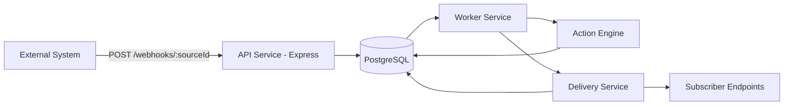

# Webhook Pipeline

[](https://github.com/ZaydFTS/webhook-pipeline/actions/workflows/ci.yml)
[](https://github.com/ZaydFTS/webhook-pipeline/actions/workflows/cd.yml)

A webhook-driven processing platform built with Node.js, TypeScript, Express, PostgreSQL, and Drizzle ORM.

It receives incoming webhooks, queues them as jobs, applies a configurable pipeline action, and delivers processed results to subscriber endpoints with retry support.

## Features

- JWT authentication with refresh tokens
- Pipeline CRUD (create, update, list, delete)
- Public webhook ingestion endpoint per pipeline source
- Asynchronous worker-based job processing
- Built-in actions:
  - `filter_fields`
  - `transform_format`
  - `http_enrich`
- Delivery attempt tracking and retry for failed webhooks
- OpenAPI/Swagger docs
- CI/CD with GitHub Actions and Google Cloud Run deployment

## Architecture

### High-level flow



### Project structure

```text
src/
  api/            # Express app, routes, controllers, middleware
  config/         # env config + swagger config
  db/             # Drizzle schemas, migrations, repositories
  services/       # business logic (auth, pipeline, job, delivery, webhook)
  worker/         # polling worker + action processor
  tests/          # Vitest unit tests
```

### Why this architecture

- Separation of concerns:
  - API handles request/response and validation.
  - Worker handles background processing and external delivery.
  - Repositories isolate database access.
- Reliability:
  - Failed deliveries are persisted and retried.
  - Jobs have explicit states (`pending`, `processing`, `completed`, `failed`).
- Scalability:
  - API and worker can scale independently.
  - Processing is decoupled from webhook ingestion latency.
- Extensibility:
  - New action types can be added in `src/worker/actions` with minimal changes.

## Tech stack

- Runtime: Node.js + TypeScript
- API: Express
- Database: PostgreSQL
- ORM / Migrations: Drizzle ORM + drizzle-kit
- Auth: JWT + bcrypt
- Validation: Zod
- API docs: swagger-jsdoc + swagger-ui-express
- Testing: Vitest
- Containers: Docker + Docker Compose
- CI/CD: GitHub Actions (CI + CD), Google Cloud Run

## Getting started

## 1) Prerequisites

- Node.js 20+
- npm
- Docker + Docker Compose (recommended for local PostgreSQL)

## 2) Install dependencies

```bash
npm ci
```

## 3) Configure environment

Create a `.env` file in the project root. Minimum required variables:

```env
PORT=3000
NODE_ENV=development
DATABASE_URL=postgresql://<user>:<password>@localhost:5433/<db>
JWT_SECRET=your-secret
JWT_EXPIRES_IN=15m
REFRESH_TOKEN_EXPIRES_IN=7d
```

For Docker Compose database service, also provide:

```env
POSTGRES_USER=postgres
POSTGRES_PASSWORD=postgres
POSTGRES_DB=webhook_pipeline
```

## 4) Start local services

### Option A: Local Node processes + Docker Postgres

```bash
docker compose up -d postgres
npm run db:push
npm run dev:api
npm run dev:worker
```

### Option B: Full Docker stack

```bash
docker compose up --build
```

## 5) API docs

- Swagger UI: `http://localhost:3000/docs`
- OpenAPI JSON: `http://localhost:3000/docs.json`

## Usage guide

## 1) Authenticate

- `POST /auth/register`
- `POST /auth/login`

Use returned access token as:

```http
Authorization: Bearer <token>
```

## 2) Create a pipeline

`POST /api/pipelines`

Example body:

```json
{
  "name": "CustomerWebhookPipeline",
  "actionType": "filter_data",
  "actionConfig": { "dataToKeep": ["id", "email"] },
  "subscriberUrls": ["https://example.com/webhooks/incoming"]
}
```

## 3) Send webhook events

`POST /webhooks/:sourceId`

Payload can be any JSON object. The API accepts the event and queues a background job.

## 4) Monitor jobs and deliveries

- `GET /api/pipelines/:id/jobs`
- `GET /api/jobs/:id`
- `GET /api/jobs/:id/deliveries`

## Useful scripts

```bash
npm run dev:api         # run API in watch mode
npm run dev:worker      # run worker in watch mode
npm run build           # compile TypeScript
npm run start:api       # run built API
npm run start:worker    # run built worker
npm run test            # run tests (watch)
npm run test:run        # run tests once
npm run test:coverage   # run tests with coverage
npm run db:generate     # generate migration files
npm run db:migrate      # apply migrations
npm run db:push         # push schema to DB
```

## CI/CD

- CI workflow (`.github/workflows/ci.yml`):
  - type-check
  - run DB schema push for tests
  - run tests
  - build project
- CD workflow (`.github/workflows/cd.yml`):
  - build and push API/worker images to Artifact Registry
  - deploy API and worker to Google Cloud Run

## Deployment notes

- Production deployments are triggered on pushes to `main`.
- CI runs on pushes to `main`/`dev` and pull requests to `main`.
- Set required repository secrets for GCP auth and project configuration before enabling CD.

## License

ISC
